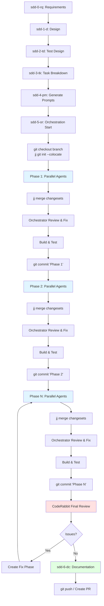

# async-sdd-slashes

This project provides a framework for developing a collection of CLI commands inspired by tools like Codex CLI, Claude CLI, and Gemini CLI, using the Specification-Driven Development (SDD) process.

## Overview

The SDD process is structured around specialized roles, each contributing to a phase of development. This ensures transparency, thorough analysis, and systematic implementation.

## SDD Files

- **sdd-0-rq.md**: Business Analyst - Extracts and defines requirements from discussion logs into a clear document.
- **sdd-1-d.md**: Software Architect - Outlines the solution architecture and implementation plan.
- **sdd-2-td.md**: QA Engineer - Plans testing strategies and coverage.
- **sdd-3-tk.md**: Engineering Manager - Breaks down tasks into phases and assigns agents.
- **sdd-4-pm.md**: Prompt Engineer - Creates activation prompts for agents based on tasks.
- **sdd-5-or.md**: Engineering Manager - Orchestrates parallel agent execution using Jujutsu (jj) for version control.
- **sdd-6-dc.md**: Document Manager - Recommends documentation integration and updates.

## Dependencies

- **Jujutsu (jj)**: Version control system for parallel agent workflow management
- **CodeRabbit CLI**: AI code review tool for final quality assurance

## Workflow

## Usage

Follow the SDD process by activating each role in sequence, using the `.tmp/` directory for intermediate artifacts like `minutes.md`, `requirements.md`, etc. This framework helps build robust CLI tools through structured development.

### Key Points
- Each phase creates parallel jj changesets for agents
- Orchestrator reviews and fixes after each phase merge
- Each phase becomes a separate git commit
- CodeRabbit reviews final implementation
- Documentation updates based on all phase changes
